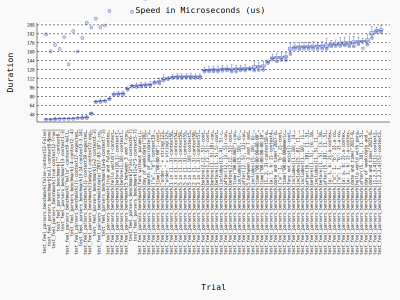

# bkflow-feel: A FEEL (Friendly Enough Expression Language) Parser for Python

## 简介
bkflow-feel 是一款基于 Python 的 FEEL (Friendly Enough Expression Language) 语法解析器，用于对 FEEL 语法表达式进行解析和运算，得到对应的 Python 对象作为计算结果。

[FEEL](https://www.omg.org/spec/DMN/) 是 OMG (Object Management Group) 定义的 DMN (Decision Model and Notation) 规范中的一部分。
所以，bkflow-feel 可用于决策引擎 (DMN) 中决策表达式的解析。

除此之外，bkflow-feel 也可用于流程引擎 (BPMN) 中分支网关条件表达式的解析。

## Quick Start

### 1. 安装依赖

```
$ pip install bkflow-feel
```

### 2. 表达式解析

```python
from bkflow_feel.api import parse_expression

print(parse_expression(expression="1+1"))  # print(2)
print(parse_expression(expression="a > b", context={"a": 2, "b": 1})) # print(True)
print(parse_expression(expression="[1,2,3,4][3]")) # print(3)
```

通过 parse_expression 函数，可以传入表达式并进行计算，parse_expression 接收以下参数：
- expression: string 类型，FEEL 表达式文本
- context: dict 类型，非必填，默认为 None，计算表达式时使用的上下文
- raise_exception: boolean 类型，非必填，默认为 True，如果解析和计算过程中校验失败或异常，是否抛出异常，如果为 False 则异常时返回 None

### 3. 注册并调用自定义函数

注册自定义函数支持两种方式，但请尽量选择一种方式进行注册，推荐使用第一种

a. 通过定义类进行注册

```python
from bkflow_feel.utils import BaseFEELInvocation


# 类初始化时注册
class HelloWorldWithParamsFunc(BaseFEELInvocation):
    class Meta:
        func_name = "hello world with params"  # FEEL 语法中调用的函数名

    def invoke(self, a, b, c=2, *args, **kwargs):
        return {"a": a, "b": b, "c": c, "args": args, "kwargs": kwargs}
```

b. 通过调用函数进行注册

```python
from bkflow_feel.utils import FEELFunctionsManager


def func_with_params(a, b, c):
    return "With params: {}, {}, {}".format(a, b, c)


REGISTER_FUNCS = {
    "func with params": "path.to.func_with_params",  # FEEL 语法中调用的函数名 和 对应的函数路径
}
FEELFunctionsManager.register_funcs(REGISTER_FUNCS)  # 注册

```

自定义函数支持参数校验

如果通过第二种方式进行函数定义，可以通过定义 Inputs 类（继承 InvocationInputsModel）来定义函数的输入，并进行校验。

Inputs 类的定义和字段校验逻辑可参考 [pydantic](https://docs.pydantic.dev/1.10/)。

同时，为了保证不具名传参的调用方式校验逻辑也能将各个位置的参数准确映射到对应的校验字段，需要在 Meta 类中定义对应的字段顺序。

示例如下：

```python
from bkflow_feel.utils import BaseFEELInvocation, InvocationInputsModel

class FuncWithInputsValidation(BaseFEELInvocation):
    class Meta:
        func_name = "func with inputs validation"

    class Inputs(InvocationInputsModel):
        a: int
        b: int
        c: int
        d = 20

        class Meta:
            ordering = ["a", "b", "c", "d"]

    def invoke(self, a, b, *args, **kwargs):
        return {"a": a, "b": b, "args": args, "kwargs": kwargs}
```

函数调用

```python
from bkflow_feel.api import parse_expression

parse_expression(expression="hello world with params(a:1,b:2)")  # {'a': 1, 'b': 2, 'c': 2, 'args': (), 'kwargs': {}}

parse_expression(expression="func with params(1,2,3)")  # With params: 1, 2, 3
```

## 支持语法详情
见[语法文档](./docs/grammer.md)

## benchmark
这里通过 pytest-benchmark 执行单测得到对应的解析性能结果：


可以看到，对于单测样例，bkflow-feel 的解析处理时间大致在 40+us - 200+us，换算成每秒可处理的简单表达式个数约为 5000 - 25000 个。
